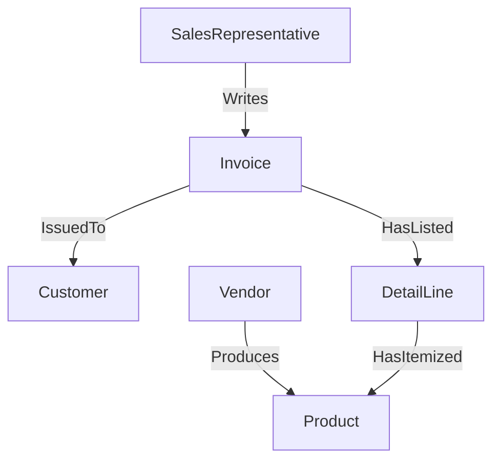
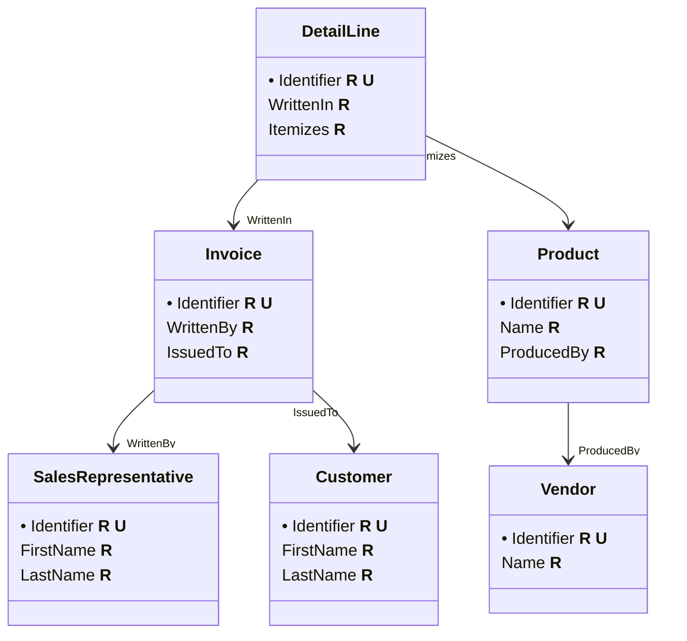

# DS 220 Group Project

<h2>Online PowerSales Reps</h2>

- [DS 220 Group Project](#ds-220-group-project)
  - [Entities](#entities)
  - [Relationships](#relationships)
  - [Entity Tables](#entity-tables)

## Entities

| Entity Name           | Description                                                       |
| --------------------- | ----------------------------------------------------------------- |
| `SalesRepresentative` | An employee who works with external clients and their requests.   |
| `Customer`            | A person external to the company who purchased our product(s).    |
| `Invoice`             | A statement list of products and services rendered to a customer. |
| `DetailLine`          | A itemized product of server listed in an invoice.                |
| `Vendor`              | An external partner the company purchases products from.          |
| `Product`             | A product produced by a vendor we are selling.                    |

## Relationships

## Entity Tables

