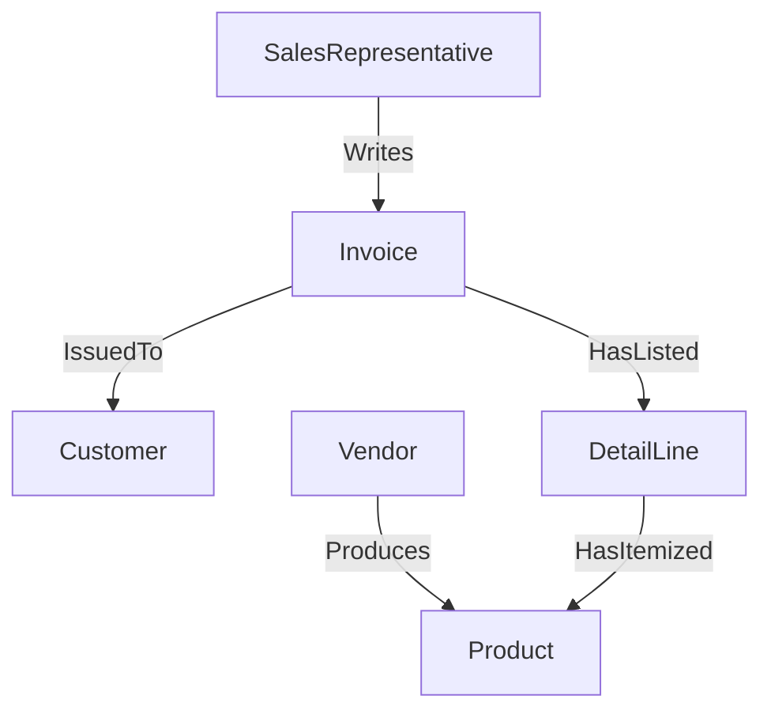
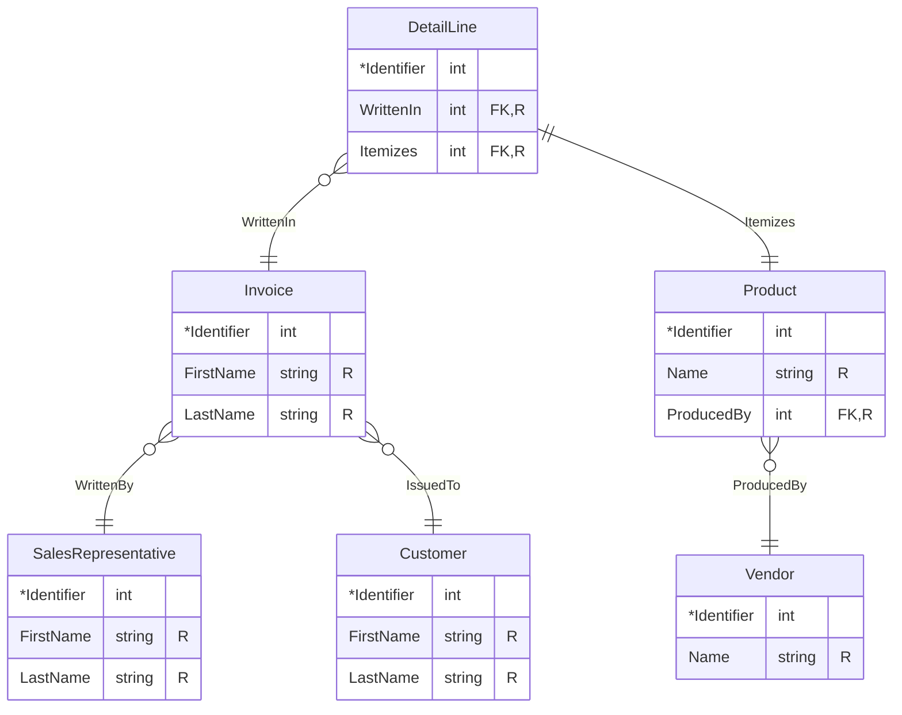

# DS 220 Group Project

<h2>Online PowerSales Reps</h2>

- [DS 220 Group Project](#ds-220-group-project)
  - [Conceptual Stage](#conceptual-stage)
    - [Entities](#entities)
    - [Relationships](#relationships)
    - [ER Diagram](#er-diagram)
    - [Requirement Queries](#requirement-queries)
  - [Logical Stage](#logical-stage)
    - [Entity Tables](#entity-tables)

## Conceptual Stage

### Entities

| Entity Name           | Description                                                       |
| --------------------- | ----------------------------------------------------------------- |
| `SalesRepresentative` | An employee who works with external clients and their requests.   |
| `Customer`            | A person external to the company who purchased our product(s).    |
| `Invoice`             | A statement list of products and services rendered to a customer. |
| `DetailLine`          | A itemized product of server listed in an invoice.                |
| `Vendor`              | An external partner the company purchases products from.          |
| `Product`             | A product produced by a vendor we are selling.                    |

### Relationships

### ER Diagram

> [!NOTE]
> PlantUML does not support partial key values for weak entities.
> Just imagine the underlines for the `Identifier` attributes for `Invoice`, `DetailLine`, and `Product` are dotted instead of solid.

> [!NOTE]
> PlantUML has bad auto-layout for Peter Chen notation. Sorry for how "wide" the diagram is.

### Requirement Queries

Here are a list of assumed queries that our sales representatives and customers will want to make:

- Customers **will want** to view our entire inventory or product on our website.

    - They will want to filter _by vendor_.
    - They will want to filter _by product_ they have _purchased before_.
    - They will want to filter _by vendors_ they have _purchased from before_.

- Sales representatives **need** to be able to issue invoices to customers.

    - They should _only_ be able to issue invoices to _existing customers_.
    - They should _only_ be able to _include product_ in _our system_ for the detail lines of the invoice.

- Sales representatives and customers **need** to be able to view invoices.

    - Sales representatives should _only_ be able to view invoices _they have issued_.
    - Customers should _only_ be able to view invoices _they been issued_.
    - Both sales representatives and customers will want to filter invoices _by vendor_.
    - Both sales representatives and customers will want to filter invoices _by product_.

## Logical Stage

### Entity Tables

