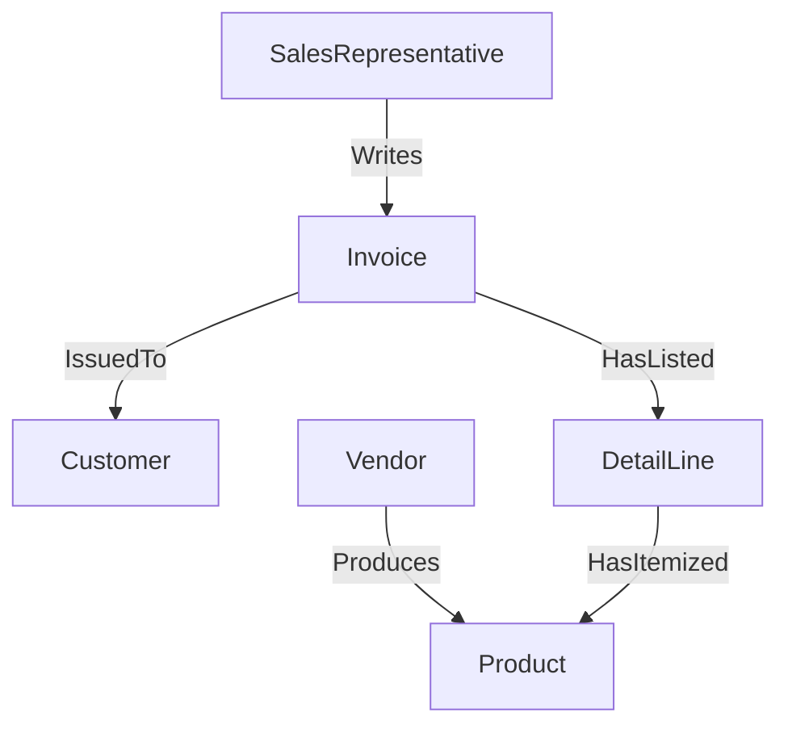
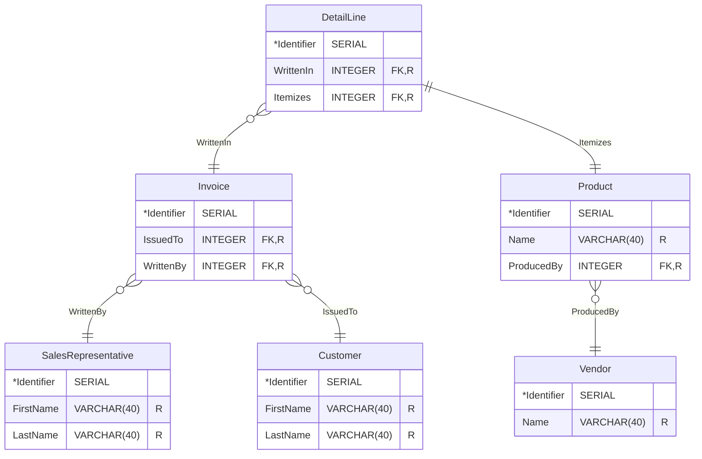

<div align="center">

# DS 220 Group Project

<h2>Online PowerSales Reps</h2>

</div>

- [DS 220 Group Project](#ds-220-group-project)
  - [Conceptual Stage](#conceptual-stage)
    - [Entities](#entities)
    - [Relationships](#relationships)
    - [ER Diagram](#er-diagram)
    - [Requirement Queries](#requirement-queries)
  - [Logical Stage](#logical-stage)
    - [Entity Tables](#entity-tables)
    - [Sample SQL Queries](#sample-sql-queries)
      - [Query Product by Vendor Identifier](#query-product-by-vendor-identifier)
      - [Query Product by Vendor Name](#query-product-by-vendor-name)
      - [Query Vendor by if Customer Has Purchased From Before](#query-vendor-by-if-customer-has-purchased-from-before)
      - [Create a New Invoice](#create-a-new-invoice)
      - [Add Detail Lines to an Invoice](#add-detail-lines-to-an-invoice)
      - [Query Invoices by Sales Representative](#query-invoices-by-sales-representative)
      - [Query Invoices by Sales Representative _and_ Vendor](#query-invoices-by-sales-representative-and-vendor)
      - [Query Invoices by Sales Representative _and_ Vendor Name](#query-invoices-by-sales-representative-and-vendor-name)

## Conceptual Stage

### Entities

| Entity Name           | Description                                                       |
| --------------------- | ----------------------------------------------------------------- |
| `SalesRepresentative` | An employee who works with external clients and their requests.   |
| `Customer`            | A person external to the company who purchased our product(s).    |
| `Invoice`             | A statement list of products and services rendered to a customer. |
| `DetailLine`          | A itemized product of server listed in an invoice.                |
| `Vendor`              | An external partner the company purchases products from.          |
| `Product`             | A product produced by a vendor we are selling.                    |

### Relationships



### ER Diagram

> [!NOTE]
> PlantUML does not support partial key values for weak entities.
> Just imagine the underlines for the `Identifier` attributes for `Invoice`, `DetailLine`, and `Product` are dotted instead of solid.

> [!NOTE]
> PlantUML has bad auto-layout for Peter Chen notation. Sorry for how "wide" the diagram is.


### Requirement Queries

Here are a list of assumed queries that our sales representatives and customers will want to make:

- Customers **will want** to view our entire inventory or product on our website.

    - They will want to filter _by vendor_.
    - They will want to filter _by product_ they have _purchased before_.
    - They will want to filter _by vendors_ they have _purchased from before_.

- Sales representatives **need** to be able to issue invoices to customers.

    - They should _only_ be able to issue invoices to _existing customers_.
    - They should _only_ be able to _include product_ in _our system_ for the detail lines of the invoice.

- Sales representatives and customers **need** to be able to view invoices.

    - Sales representatives should _only_ be able to view invoices _they have issued_.
    - Customers should _only_ be able to view invoices _they been issued_.
    - Both sales representatives and customers will want to filter invoices _by vendor_.
    - Both sales representatives and customers will want to filter invoices _by product_.

## Logical Stage

### Entity Tables



### Sample SQL Queries

#### Query Product by Vendor Identifier

> [!NOTE]
> The prefixes in the examples below correspond to the first letter of each database table.
>
> ex. <code><strong>V_</strong>123456789</code> -> **V**endor.

> [!NOTE]
> The prefixes are just for demonstration purposes _only_. Primary keys in the database are purely interger values with no prefixes.

```sql
SELECT *
    FROM Product
    WHERE Product.ProducedBy = V_123456789;
```

#### Query Product by Vendor Name

```sql
SELECT *
    FROM Product
    INNER JOIN Vendor
        ON Vendor.Identifier = Product.ProducedBy
    WHERE Vendor.Name = "ACME Industries";
```

#### Query Vendor by if Customer Has Purchased From Before

```sql
SELECT DISTINCT Vendor.*
    FROM Customer
    INNER JOIN Invoice
        ON Invoice.IssuedTo = Customer.Identifier
    INNER JOIN DetailLine
        ON DetailLine.WrittenIn = Invoice.Identifier
    INNER JOIN Product
        ON Product.Identifier = DetailLine.Itemizes
    INNER JOIN Vendor
        ON Vendor.Identifier = Product.ProducedBy
    WHERE Customer.Identifier = C_123456789;
```

#### Create a New Invoice

```sql
INSERT
    INTO Invoice (IssuedTo, WrittenBy)
    VALUES (C_123456789, S_987654321);
```

#### Add Detail Lines to an Invoice

```sql
INSERT
    INTO DetailLine (WrittenIn, Itemizes)
    VALUES
        (I_123456789, P_987654321),
        (I_123456789, P_564738291),
        (I_123456789, P_281983746);
```

#### Query Invoices by Sales Representative

```sql
SELECT *
    FROM Invoice
    WHERE Invoice.WrittenBy = S_123456789;
```

#### Query Invoices by Sales Representative _and_ Vendor

```sql
SELECT DISTINCT Invoice.*
    FROM Invoice
    JOIN DetailLine ON DetailLine.WrittenIn = Invoice.Identifier
    JOIN Product ON Product.Identifier = DetailLine.Itemizes
    JOIN Vendor ON Vendor.Identifier = Product.ProducedBy
    WHERE Vendor.Identifier = V_123456789
        AND Invoice.WrittenBy = S_987654321;
```

#### Query Invoices by Sales Representative _and_ Vendor Name

```sql
SELECT DISTINCT Invoice.*
    FROM Invoice
    JOIN DetailLine ON DetailLine.WrittenIn = Invoice.Identifier
    JOIN Product ON Product.Identifier = DetailLine.Itemizes
    JOIN Vendor ON Vendor.Identifier = Product.ProducedBy
    WHERE Vendor.Name = "ACME Industries"
        AND Invoice.WrittenBy = S_987654321;
```